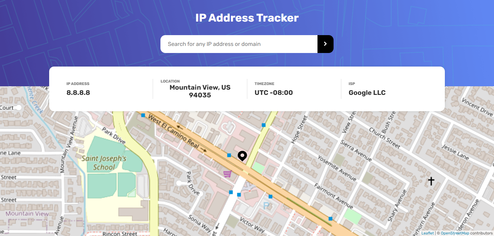
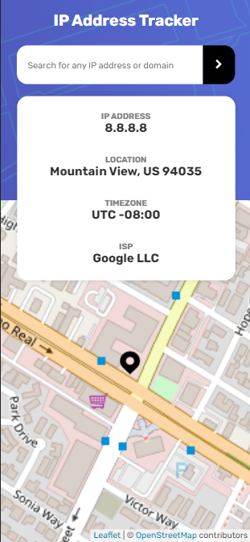

# Frontend Mentor - IP address tracker solution

This is a solution to the [IP address tracker challenge on Frontend Mentor](https://www.frontendmentor.io/challenges/ip-address-tracker-I8-0yYAH0). Frontend Mentor challenges help you improve your coding skills by building realistic projects.

## Table of contents

- [Overview](#overview)
  - [The challenge](#the-challenge)
  - [Screenshots](#screenshots)
  - [Links](#links)
- [My process](#my-process)
  - [Built with](#built-with)
  - [What I learned](#what-i-learned)
  - [Continued development](#continued-development)
  - [Useful resources](#useful-resources)
- [Author](#author)
- [Acknowledgments](#acknowledgments)

## Overview

### The challenge

The [challenge](https://www.frontendmentor.io/challenges/ip-address-tracker-I8-0yYAH0/hub/ip-address-tracker-_uZWiRMBJ) is to build an IP Address Tracker app. To obtain the IP address locations, [IP Geolocation API by IPify](https://geo.ipify.org/) was used and to generate the map, [LeafletJS](https://leafletjs.com/) was used.

<!--  -->

### Screenshots

#### Desktop

#### Mobile

### Links

- Solution URL: [Add solution URL here](https://your-solution-url.com)
- Live Site URL: [Add live site URL here](https://your-live-site-url.com)

## My process

### Built with

- HTML5
- CSS
- Scss
- Flexbox
- [Vue.js](https://v3.vuejs.org/)
- [Fetch API](https://developer.mozilla.org/en-US/docs/Web/API/Fetch_API)
- [IP Geolocation API by IPify](https://geo.ipify.org/)
- [LeafletJS](https://leafletjs.com/)

## Author

- GitHub - [@ederwms](https://github.com/ederwms)
- Frontend Mentor - [@ederwms](https://www.frontendmentor.io/profile/ederwms)
